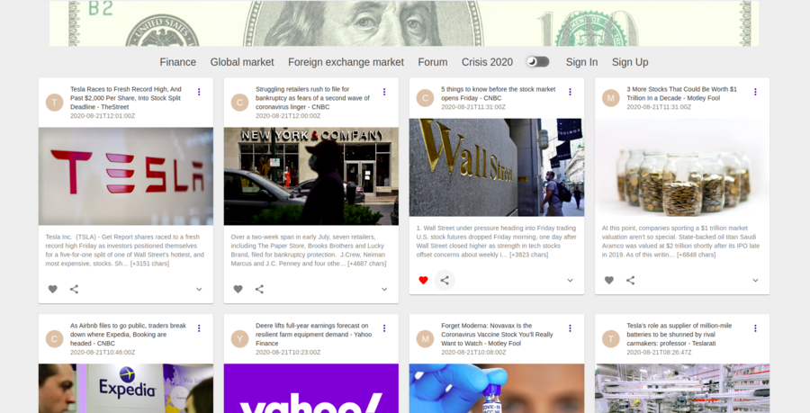
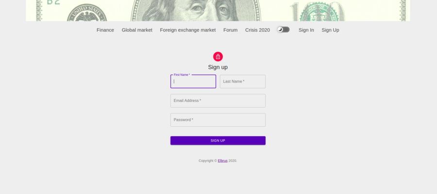
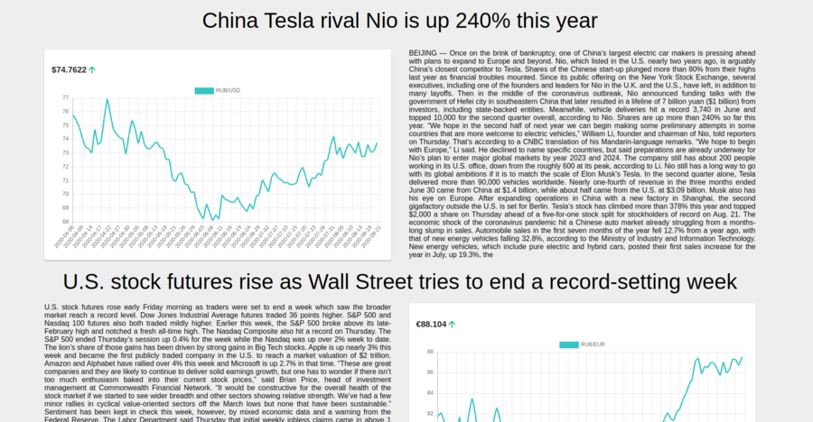
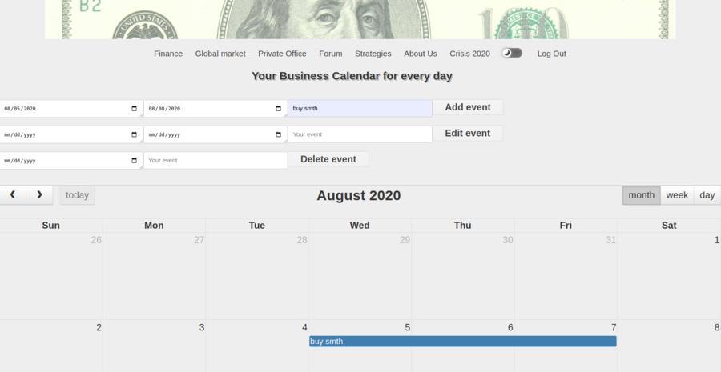

<h1 style='color:blue'>IMM Financial</h1>

<h2 style='color:green'>Target</h2>

Сreating a simple APP for monitoring news, exchange rates, as well as stocks.

<h2 style='color:green'>Stack</h2>

1. React JS
2. Redux, Redux-Thunk, Redux-Saga
3. Firebase (entry group)
4. Mongo Atlas (user privat office)
5. Express
6. WebSocket
7. Material-UI
8. styled-components

<h2 style='color:green'>Usage</h2>

You should take the two unique keys in <a href='https://www.alphavantage.co/'>Alpha Vantage</a> and one unique key in <a href='https://newsapi.org'>News API</a>. And create .env file in root folder: 
 
REACT_APP_ALPHA_KEY_ONE=alpha_key_1 
REACT_APP_ALPHA_KEY_TWO=alpha_key_2 
REACT_APP_ALPHA_KEY_THREE=alpha_key_2 
REACT_APP_ALPHA_KEY_FOUR=alpha_key_1 
 
REACT_APP_NEWS_KEY=news_api_key 

All applications will work with this data except for the PRIVATE OFFICE.

If you need watch PRIVATE OFFICE, add in .env this: 

On command line, type in the following commands:

        npm install        
        npm start  
 or:
        
        yarn install        
        yarn start 

NODE_DB_MONGO = YOU_LOCAL_MONGO_DB 
NODE_ENV_PORT = 4444 

<h2 style='color:green'>Features</h2>
<h3>News update</h3>

<h3>User Authentication and Authorization via Firebase</h3>

 
<h3>Light- Dark Theme Switcher</h3>

.gif)

<h3>Forex line Charts</h3>

<h3>User' Account Event Planner</h3>

